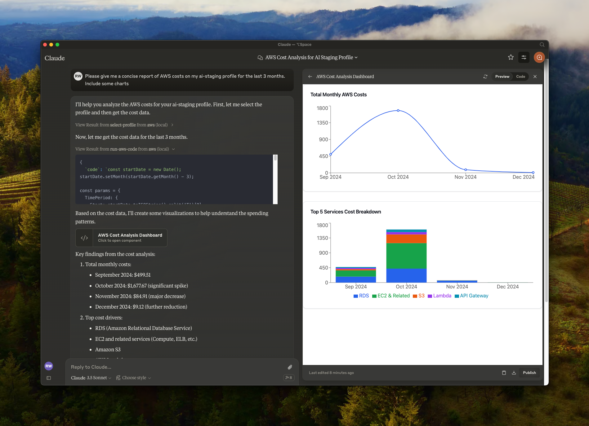

# AWS MCP

A [Model Context Protocol (MCP)](https://www.anthropic.com/news/model-context-protocol) server that enables AI assistants like Claude to interact with your AWS environment. This allows for natural language querying and management of your AWS resources during conversations. Think of better Amazon Q alternative.



## Features

- 🔍 Query and modify AWS resources using natural language
- ☁️ Support for multiple AWS profiles and SSO authentication
- 🌐 Multi-region support
- 🔐 Secure credential handling (no credentials are exposed to external services, your local credentials are used)
- 🏃‍♂️ Local execution with your AWS credentials

## Prerequisites

- [Node.js](https://nodejs.org/)
- [Claude Desktop](https://claude.ai/download)
- AWS credentials configured locally (`~/.aws/` directory)

## Installation

1. Clone the repository:

```bash
git clone https://github.com/RafalWilinski/aws-mcp
cd aws-mcp
```

2. Install dependencies:

```bash
pnpm install
# or
npm install
```

## Usage

1. Open Claude desktop app and go to Settings -> Developer -> Edit Config


2. Add the following entry to your `claude_desktop_config.json`:

```json
{
  "mcpServers": {
    "aws": {
      "command": "npm",
      "args": ["--prefix", "/Users/<YOUR USERNAME>/aws-mcp", "start"]
    }
  }
}
```

Important: Replace `/Users/<YOUR USERNAME>/aws-mcp` with the actual path to your project directory.

3. Restart Claude desktop app. You should see this:


4. Start by selecting an AWS profile or jump to action by asking:
   - "List available AWS profiles"
   - "List all EC2 instances in my account"
   - "Show me S3 buckets with their sizes"
   - "What Lambda functions are deployed in us-east-1?"
   - "List all ECS clusters and their services"

## Troubleshooting

To see logs:

```bash
tail -n 50 -f ~/Library/Logs/Claude/mcp-server-aws.log
# or
tail -n 50 -f ~/Library/Logs/Claude/mcp.log
```

## Features in Development

- [ ] MFA support
